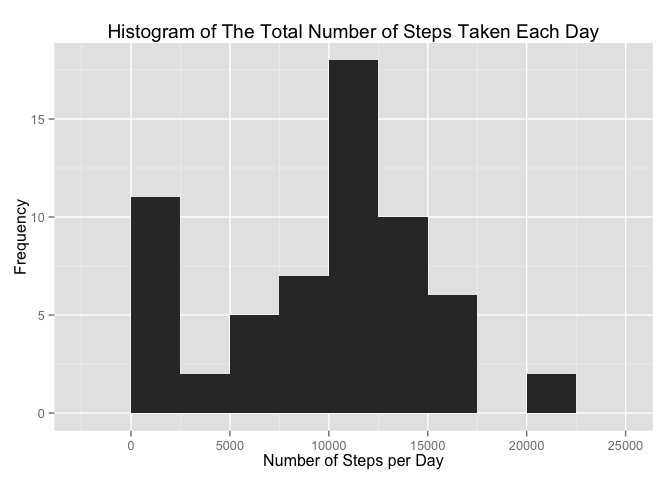
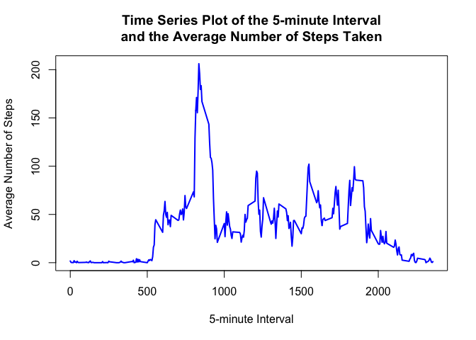
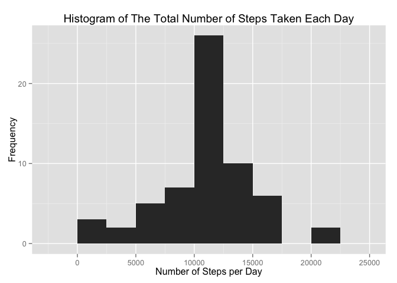
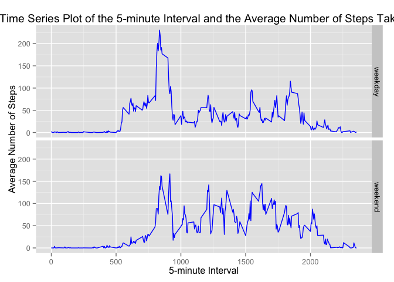

# Reproducible Research: Peer Assessment 1


## Loading and preprocessing the data
Here we load the data from the csv file and show part of its contents
using head() function.

```r
data <- read.csv('activity.csv')
head(data)
```

```
##   steps       date interval
## 1    NA 2012-10-01        0
## 2    NA 2012-10-01        5
## 3    NA 2012-10-01       10
## 4    NA 2012-10-01       15
## 5    NA 2012-10-01       20
## 6    NA 2012-10-01       25
```

## What is mean total number of steps taken per day?

We calculate the total number of steps taken per day

```r
total_steps <- sum(data$steps, na.rm = T)
```

We load the dplyr package.

```r
library(dplyr)
```

```
## 
## Attaching package: 'dplyr'
## 
## The following object is masked from 'package:stats':
## 
##     filter
## 
## The following objects are masked from 'package:base':
## 
##     intersect, setdiff, setequal, union
```

In order to prepare the data for the histogram of the total number of steps taken each day, 
we use the summarise() function to calculate the total, mean and median values, after 
we group the data by date.

```r
data_by_day <- group_by(data, date)
steps_by_day <- summarise(data_by_day, 
                   total_steps = sum(steps, na.rm = TRUE),
                   mean_steps = mean(steps, na.rm = TRUE),
                   median_steps = median(steps, na.rm = TRUE))
```

Then, we make a histogram ussing ggplot2 package's ggplot function.

```r
library("ggplot2")
p <- ggplot(data=steps_by_day, aes(x=total_steps))
p <- p + geom_histogram(binwidth = 2500)
p <- p + labs(title = "Histogram of The Total Number of Steps Taken Each Day")
p <- p + xlab("Number of Steps per Day")
p <- p + ylab("Frequency")
plot(p)
```

 

Afterwards, we calculate the mean 

```r
mean(steps_by_day$total_steps)
```

```
## [1] 9354.23
```

and the median of the total number of steps taken each day.

```r
median(steps_by_day$total_steps)
```

```
## [1] 10395
```

## What is the average daily activity pattern?

We make a time series plot (i.e. type = "l") of the 5-minute interval (x-axis) and the average number of steps taken, averaged across all days (y-axis). 


```r
data_by_interval <- group_by(data, interval)
steps_by_interval <- summarise(data_by_interval, 
                  avg_steps = mean(steps, na.rm = T))
plot(steps_by_interval$avg_steps ~ steps_by_interval$interval, 
     type = 'l', 
     col = "blue",
     lwd = 2,
     xlab = "5-minute Interval", 
     ylab = "Average Number of Steps",
     main = "Time Series Plot of the 5-minute Interval
and the Average Number of Steps Taken")
```

 

The 5-minute interval, on average across all the days in the dataset, that contains the maximum number of steps is calculated as:


```r
filter(steps_by_interval, steps_by_interval$avg_steps == max(steps_by_interval$avg_steps))
```

```
## Source: local data frame [1 x 2]
## 
##   interval avg_steps
## 1      835  206.1698
```

## Imputing missing values

We calculate the total number of missing values in the dataset (i.e. the total number of rows with NAs)

```r
        sum(!complete.cases(data))
```

```
## [1] 2304
```
We choose to replace the missing values for the number of steps taken each day, in each time interval, with the average number of total steps for this interval.

For this reason, we use the data grouped by interval and create a helping structure (means_table) which replicated the average number of steps for each interval, as many time as the length of the original data rows with missing values. We then replace the missing values in the original data set (data).


```r
means_table <- rep(steps_by_interval$avg_steps, length(which(is.na(data))))
data[which(is.na(data)), ]$steps <- means_table[which(is.na(data))]
```
Then, we group the new data by date, compute the total, mean and median steps again and make the histogram.

```r
data_by_day <- group_by(data, date)
steps_by_day <- summarise(data_by_day, 
                          total_steps = sum(steps, na.rm = TRUE),
                          mean_steps = mean(steps, na.rm = TRUE),
                          median_steps = median(steps, na.rm = TRUE))
p <- ggplot(data=steps_by_day, aes(x=total_steps))
p <- p + geom_histogram(binwidth = 2500)
p <- p + labs(title = "Histogram of The Total Number of Steps Taken Each Day")
p <- p + xlab("Number of Steps per Day")
p <- p + ylab("Frequency")
plot(p)
```

 

The mean and median of the total number of steps are now

```r
mean(steps_by_day$total_steps)
```

```
## [1] 10766.19
```

```r
median(steps_by_day$total_steps)
```

```
## [1] 10766.19
```

The values for mean and median were 9354.23 and 10395 repsectively before the fill-in, while now they are both 10766.19. The histogram is quite similar, while the only difference is the hogher frequency of the total number of steps, as expected after the replacement of the missing values. 

## Are there differences in activity patterns between weekdays and weekends?

We copy the filled-in data set to a new one and create a new factor variable (dayType) that indicates whether the day of each entry is a weekday or weekend day

```r
newdata <- data  
newdata$dayType <- ifelse(weekdays(as.Date(data$date))
                          %in% c('Saturday', 'Sunday'), "weekend", "weekday")
```

Then, we make a panel plot containing a time series plot of the 5-minute interval and the average number of steps taken, averaged across all weekday days or weekend days 

```r
newdata_by_interval <- group_by(newdata, interval, dayType)
steps_by_interval <- summarise(newdata_by_interval, 
                               avg_steps = mean(steps, na.rm = T))
p <- ggplot(data=steps_by_interval, aes(x=interval, y=avg_steps))
p <- p + geom_line(color = "blue")
p <- p + facet_grid(dayType ~ .)
p <- p + labs(title = "Time Series Plot of the 5-minute Interval and the Average Number of Steps Taken")
p <- p + xlab("5-minute Interval")
p <- p + ylab("Average Number of Steps")
plot(p) 
```

 

We observe that the activity patterns for weekdays and weekends differ mainly in two things: 1) the maximum number of steps during weeknds is well under 200, compared to a much higher value during weekdays, although they are observed at the same (or close) time interval. 2) The 5-minute time intervals in the beginning of the noticeable activity (after interval 500) have lower values during weekends, indicating later starting and lower activity patterns during the weekend.
